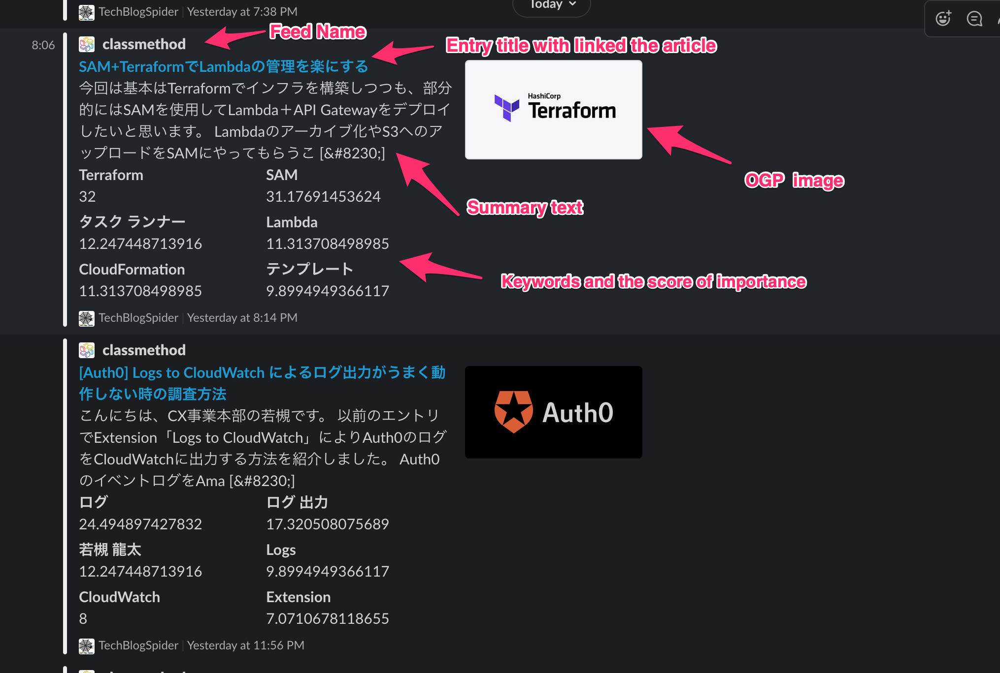

# Tech Blog Spider


> Crawls tech blogs and notifies you via Slack

## Background

Software engineers often subscribe to various tech blogs in order to keep up with the ever-evolving technology domain.

However, visiting many tech blogs each time is a painstaking task, and I would like to receive feeds to help me subscribe if possible.

Of course, you can use a dedicated feeder to receive feeds, but I'd like to send feeds to Slack, which I usually use for work, so that I can subscribe to tech blogs without having to consciously open feeder.

So I decided to create a system that would periodically go to the registered entries and notify Slack when there was an update.

There are similar mechanisms such as Slack's /feed and RSS registration using IFTTT, but both of them are not easy to use because the free version has a limit on the number of registrations.

Therefore, I decided to use GitHub Actions and Harper DB, which are free for OSS.

### Why Spider?

It doesn't have any particular meaning, but I imagined a spider running around on a tech blog (the web). But that's a crawler, isn't it?

## Setup

### Preparing Harper DB

[HarperDB](https://harperdb.io/) is a managed NoSQL DB service, and Tech Blog Spider uses HarperDB to store the last update of RSS entries.

- Get account for [HarperDB](https://studio.harperdb.io/sign-up)

- Create an organization (or using existing org)

- Create an instance (recommend: `HarperDB Cloud Instance`)

- Create a scheme (By default, `prd`)

- Create 2 tables
  - entry_urls (hash attr is `name`)
  - last_published (hash attr is `name`)

### Set entries

Edit `entry.csv` to register the RSS entries you want to subscribe to.

- First column is `name`: must be unique.
- Second column is `url`: RSS feed url (compatible RSS1.0, RSS2.0, Atom0.3, Atom1.0).
- Third column is `icon` if you want to set another icon instead of favicon.

```csv
name,url,icon
"aws","https://aws.amazon.com/jp/blogs/aws/feed/","https://i.imgur.com/Z5YLUiS.png"
```

### Create Slack incoming webhook

Slack incoming webhooks using the new Slack API, Apps, consume Apps, so I added a custom integration.

### Set environment

Set environment (OS Env) the below.

| name              | descriotion                                           | default | 
| ----------------- | ----------------------------------------------------- | ------- | 
| HARPERDB_URL      | HarperDB instance url                                 | -       | 
| HARPERDB_USERNAME | HarperDB username                                     | -       | 
| HARPERDB_PASSWORD | HarperDB password                                     | -       | 
| HARPERDB_SCHEMA   | HarperDB schemas                                      | prd     | 
| SLACK_WEBHOOK_URL | Slack incoming webhook url                            | -       | 
| LOGGING_LEVEL     | Logging level (CRITICAL, ERROR, WARNING, INFO, DEBUG) | INFO    |

#### How to use it in GitHub Actions

For example, when setting environment variables in GitHub Actions, it is recommended to register the environment variable itself in the secret and refer to it from the secret as shown below.

```yaml
- name: Run RSS
  env:
    HARPERDB_URL: ${{ secrets.HARPERDB_URL }}
    HARPERDB_USERNAME: ${{ secrets.HARPERDB_USERNAME }}
    HARPERDB_PASSWORD: ${{ secrets.HARPERDB_PASSWORD }}
    HARPERDB_SCHEMA: ${{ secrets.HARPERDB_SCHEMA }}
    SLACK_WEBHOOK_URL: ${{ secrets.SLACK_WEBHOOK_URL }}
    LOGGING_LEVEL: "DEBUG"
  run: python3 src/main.py
```

### Install Dependencies

The required libraries are listed in requirements.txt and can be installed by pip.

```
pip install -r requirements.txt
```

## Usage

### Preparation

```
python src/create_config.py
```

### Run

```
python src/main.py
```

## Demo



## License

[MIT © tubone.](LICENSE)